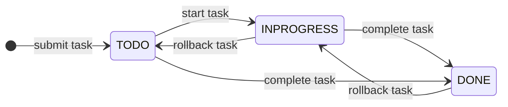
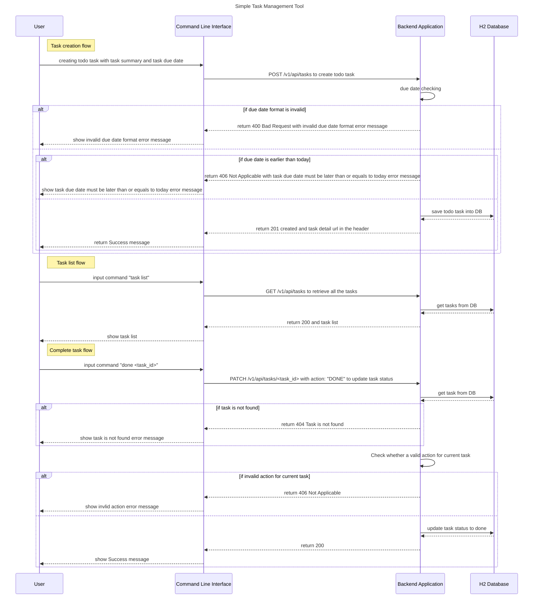

## Simple Task Management tool
This is a simple task management tool, and it implemented both client and server services. It uses Java + Spring Boot + H2 Database to provide backend service, all thet tasks will be stored into H2 Database. For the client service, it uses Python to provide command line user interface, then users can manage tasks via executing tasks.py file with parameters.

### High Level Architecture

### Restful APIs
Swagger url: `http://localhost:8080/swagger-ui/index.html`
1. `POST /v1/api/tasks`    - _Create TODO task_
2. `GET /v1/api/tasks` - _Retrieve all tasks_
3. `GET /v1/api/tasks/{id}` - _Inquiry task details_
4. `PATCH /v1/api/tasks/{id}` - _Update task status (including a simple state machine inside)_

### How to run this project
#### _**1. Prerequisites**_
Ubuntu 18.04, JDK 8/11, Maven 3, H2 Database, Python3

#### _**2. Launch backend service**_
1. `mvn clean`

2. `mvn package`

3. `java -jar target/TODO-0.0.1-SNAPSHOT.jar`

or executing shell script to start: `./start.sh`
and pressing Ctrl-C to stop

#### _**3. Using Command Line Client to interact**_
Install dependency
`pip3 install -r requirements.txt`

*Usage:*
1. Help
`python3 tasks.py -h`

2. Add task
`python3 tasks.py add 
 <due_date>`

3. List all tasks
`python3 tasks.py list`

4. List all tasks that will expire today
`python3 tasks.py list --expiring-today`
or
`python3 tasks.py list -et`

5. Complete task
`python3 tasks.py done <task_id>`

   
### Simple State Machine for task status

### Sequence Diagram

