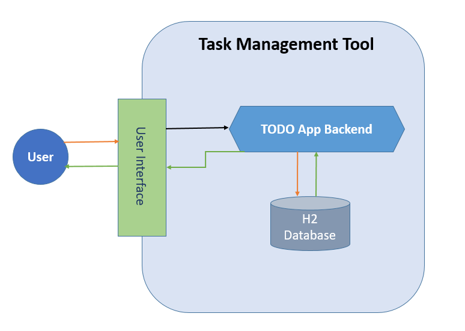
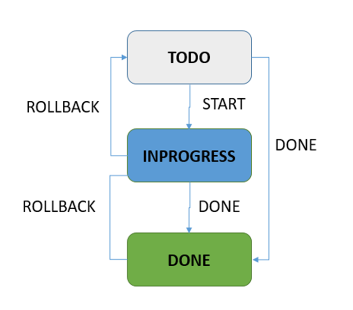

## Simple Task Management System
This is a simple task management tool.

### Feature
1. Create TODO task
2. Retrieve all tasks
3. Inquiry task details
4. Update task status (including a simple state machine)

### Prerequisites
JDK 8, Maven 3, Sprint Boot, H2, Python3

### Architecture

### How to run this project
#### 1. Launch backend server
`cd ./TODO`

`mvn clean`

`mvn package`

`java -jar target/TODO-0.0.1-SNAPSHOT.jar`

#### 2. Command Line Client - Python
`cd ./client`

Install dependency
`pip install -r requirements.txt`

*Usage:*
1. Help
`python tasks.py -h`

2. Add task
`python tasks.py add 
 <due_date>`

3. List all tasks
`python tasks.py list`

4. List all tasks that will expire today
`python tasks.py list --expiring-today`
or
`python tasks.py list -et`

5. Complete task
`python tasks.py done <task_id>`

### Simple State Machine for task status

